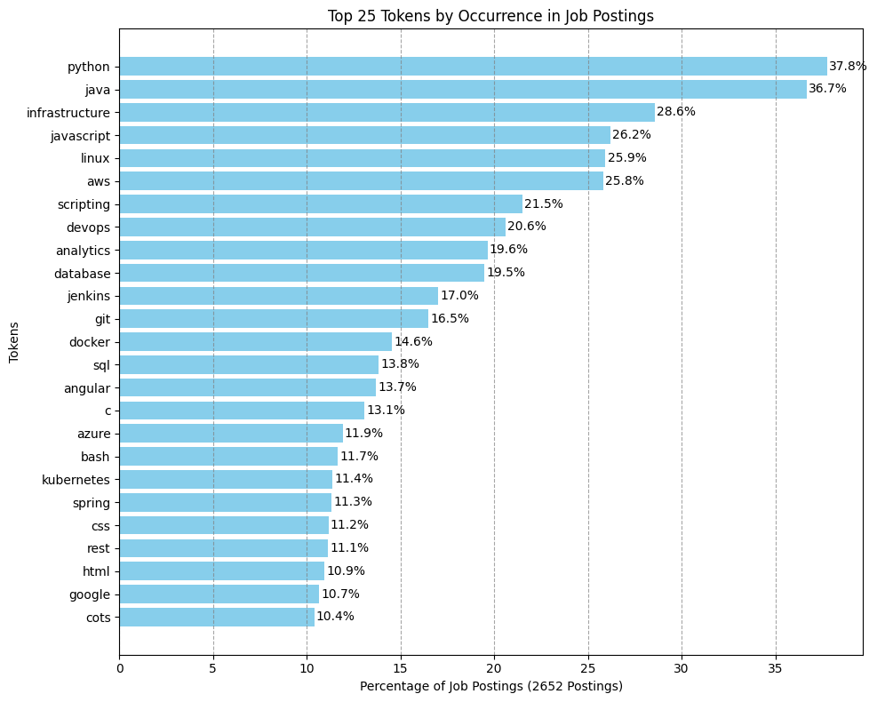

## Job Scraper
Job scraper, used to determine in-demand skills for software engineers.

## Tech used
* [Selenium](https://www.selenium.dev/) - Scraping a JavaScript-heavy website
* [SQLAlchemy](https://www.sqlalchemy.org/) - Object Relational Mapper
* [Alembic](https://alembic.sqlalchemy.org/en/latest/) - Migrations
* [SQLite](https://www.sqlite.org/) - Storing scraped jobs
* [PySpark](https://spark.apache.org/docs/latest/api/python/index.html) - Token analysis

## Insights

Python, Java, and JavaScript are the most popular languages among job postings in the "IT - Software" category on ClearanceJobs, which comes as no surprise. However, it is surprising to see that Angular is considerably more popular than React (14% Angular vs. 9% React), especially since, in the broader software engineering industry, React is nearly twice as popular as Angular (according to the [2024 Stack Overflow Developer Survey](https://survey.stackoverflow.co/2024/technology#most-popular-technologies-webframe-prof)).

The data was scraped in October 2024. It is important to note that tokens were limited to words containing only letters, meaning that technologies like .NET (~3%), C++ (~11%), and C# (~5%) are not displayed in the rankings. Despite C# and Java being comparable in demand across the wider industry, ClearanceJobs leans heavily toward Java. AWS significantly outpaces Azure in popularity (25% vs. 12%). On the database side, RDS (7.5%) and Oracle (7%) are neck-and-neck, but both surpass Postgres (4%) — although it is likely that a significant portion of RDS databases are actually running Postgres.

In summary, if you're looking to find a job on ClearanceJobs, having experience with Java, Python, Javascript, and AWS is important. On the frontend, Angular is the framework of choice, while on the backend, RDS (probably with Postgres) or Oracle are your best bets.

### Top Tokens (Percentage of Job Postings where Token is Mentioned) out of 2,652 scraped jobs:

python - 37.78% 
java - 36.69% 
infrastructure - 28.58% 
javascript - 26.21% 
linux - 25.94% 
aws - 25.83% 
scripting - 21.49% 
devops - 20.59% 
analytics - 19.65% 
database - 19.49% 
jenkins - 17.01% 
git - 16.48% 
docker - 14.56% 
sql - 13.84% 
angular - 13.69% 
c - 13.08% 
azure - 11.92% 
bash - 11.65% 
kubernetes - 11.39% 
spring - 11.31% 
css - 11.16% 
rest - 11.12% 
html - 10.94% 
google - 10.67% 
cots - 10.41% 
unix - 9.95% 
scripts - 9.73% 
elasticsearch - 9.24% 
ansible - 8.97% 
react - 8.79% 
cybersecurity - 8.22% 
apis - 8.18% 
gots - 8.11% 
gitlab - 7.99% 
protocols - 7.62% 
github - 7.50% 
rds - 7.50% 
excel - 7.39% 
junit - 7.20% 
virtualization - 7.16% 
servers - 7.05% 
oracle - 6.98% 
springboot - 6.83% 
cisco - 6.41% 
relational - 6.37% 
api - 6.33% 
modeling - 6.30% 
nosql - 6.11% 
distributed - 6.11% 
ui - 6.07% 
restful - 6.07% 
pipelines - 6.00% 
mysql - 6.00% 
json - 5.92% 
nifi - 5.92% 
apache - 5.81% 
ms - 5.69% 
perl - 5.51% 
powershell - 5.17% 
elastic - 5.09% 
xml - 5.09% 
containerization - 5.02% 
mongodb - 4.86% 
efs - 4.68% 
katalon - 4.64% 
backend - 4.64% 
shell - 4.60% 
embedded - 4.56% 
terraform - 4.45% 
postgresql - 4.19% 
puppet - 4.19% 
std - 4.19% 
phantom - 4.19% 
maven - 4.11% 
microservices - 4.00% 
r - 4.00% 
servicenow - 3.96% 
cno - 3.92% 
ruby - 3.88% 
tomcat - 3.88% 
postgres - 3.77% 
devsecops - 3.70% 
splunk - 3.66% 
eclipse - 3.62% 
dodaf - 3.58% 
hadoop - 3.54% 
pipeline - 3.36% 
typescript - 3.36% 
lambda - 3.32% 
visualization - 3.24% 
rf - 3.09% 
kafka - 3.09% 
firewalls - 3.02% 
etl - 3.02% 
vmware - 3.02% 
pig - 2.98% 
vue - 2.90% 
assembly - 2.90% 
nodejs - 2.64% 
cryptography - 2.56% 
cloudformation - 2.49% 
sharepoint - 2.45% 
go - 2.38% 
kibana - 2.34% 
jquery - 2.22% 
spark - 2.19% 
elk - 2.11% 
hive - 2.11% 
bootstrap - 2.07% 
hashing - 2.07% 
ip - 2.04% 
mbse - 2.00% 
mongo - 2.00% 
frontend - 1.96% 
iac - 1.96% 
dynamodb - 1.96% 
cli - 1.92% 
dns - 1.89% 
chef - 1.81% 
grafana - 1.81% 
selenium - 1.81% 
geospatial - 1.77% 
js - 1.77% 
swift - 1.77% 
php - 1.70% 
dashboards - 1.62% 
hdfs - 1.62% 
san - 1.58% 
sqs - 1.58% 
android - 1.55% 
centos - 1.55% 
solr - 1.55% 
visualizations - 1.55% 
helm - 1.55% 
node - 1.51% 
sysml - 1.51% 
ghidra - 1.51% 